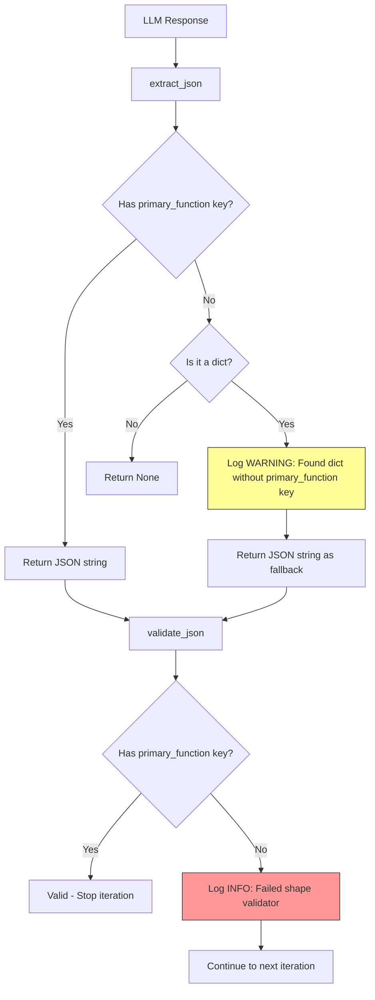

# Context Collection JSON Schema Mismatch Fix Plan

## Problem Summary

The `ContextCollectionAnalyzer` is failing to validate JSON responses from the LLM because the LLM is returning a different JSON structure than expected. This causes unnecessary iteration loops, wasting tokens and time.

### Log Lines Observed

```
2026-04-15 22:40:55,561 - hindsight.core.llm.iterative.context_collection_analyzer - WARNING - context_collection_analyzer.py:76 - [ContextCollectionAnalyzer] Found dict without 'primary_function' key - using as fallback
2026-04-15 22:40:55,561 - hindsight.core.llm.iterative.base_iterative_analyzer - INFO - base_iterative_analyzer.py:394 - [ContextCollectionAnalyzer] Found JSON but failed shape validator in iteration 7 — got dict with keys: ['function_name', 'file_path', 'lines', 'code'] — continuing
2026-04-15 22:40:55,561 - hindsight.core.llm.iterative.base_iterative_analyzer - INFO - base_iterative_analyzer.py:355 - [ContextCollectionAnalyzer] No structured output found, continuing iteration 8
```

---

## Root Cause Analysis

### What the Code Expects

The [`ContextCollectionAnalyzer.validate_json()`](hindsight/core/llm/iterative/context_collection_analyzer.py:98) method expects a JSON object with a `primary_function` key at the **top level**:

```python
def validate_json(self, parsed_json: Any) -> bool:
    if not isinstance(parsed_json, dict):
        return False
    return 'primary_function' in parsed_json
```

The expected schema from the system prompt is:

```json
{
  "schema_version": "1.0",
  "primary_function": {
    "function_name": "string",
    "class_name": "string | null",
    "file_path": "string",
    ...
  },
  "callees": [...],
  "callers": [...],
  ...
}
```

### What the LLM Actually Returned

From the conversation log at [`/Users/sgurivireddy/llm_artifacts/almanacapps/response_challenger/2/step1_context_collection.md`](/Users/sgurivireddy/llm_artifacts/almanacapps/response_challenger/2/step1_context_collection.md), in Turn 6 (iteration 7), the LLM returned:

```json
{
  "context_bundle": {
    "target_function": {
      "name": "MotionAlarmSensorKitWriter::injectSamples:",
      "file": "apps/StudyApp/AlmanacWriterCommon/SensorWriter.m",
      "lines": "157-182",
      "code": "..."
    },
    "class_interface": {...},
    "callees": [...],
    "callers": [...],
    ...
  }
}
```

### The Mismatch

| Aspect | Expected | Actual |
|--------|----------|--------|
| Top-level key | `primary_function` | `context_bundle` |
| Function key | `primary_function` | `target_function` |
| Field names | `function_name`, `start_line`, `end_line` | `name`, `lines` (as string range) |

### Why This Happens

1. **The LLM is not following the exact schema** specified in the system prompt
2. **The LLM wraps the response** in a `context_bundle` object instead of returning the schema directly
3. **The LLM uses different field names** like `target_function` instead of `primary_function`
4. **The fallback logic** in [`extract_json()`](hindsight/core/llm/iterative/context_collection_analyzer.py:71) returns the dict anyway, but then [`validate_json()`](hindsight/core/llm/iterative/context_collection_analyzer.py:98) rejects it

---

## Flow Diagram



---

## Recommended Solution: Improve the System Prompt

Add concise, explicit instructions to the system prompt to enforce the exact schema. This addresses the root cause by guiding the LLM to produce the correct format.

### Changes to Make

Add the following section to [`hindsight/core/prompts/contextCollectionProcess.md`](hindsight/core/prompts/contextCollectionProcess.md) after the "OUTPUT FORMAT" section (around line 176):

```markdown
---

## CRITICAL OUTPUT FORMAT REQUIREMENTS

1. Your response MUST be a single JSON object (not wrapped in any container)
2. The JSON object MUST have a `primary_function` key at the TOP LEVEL
```

### Where to Insert

Insert after line 175 (`Your response must start with '{' and end with '}'.`) and before line 177 (`### JSON Context Bundle Schema`):

**Before:**
```markdown
Your response must start with `{` and end with `}`.

### JSON Context Bundle Schema
```

**After:**
```markdown
Your response must start with `{` and end with `}`.

---

## CRITICAL OUTPUT FORMAT REQUIREMENTS

1. Your response MUST be a single JSON object (not wrapped in any container)
2. The JSON object MUST have a `primary_function` key at the TOP LEVEL

### JSON Context Bundle Schema
```

---

## Files to Modify

| File | Changes |
|------|---------|
| [`hindsight/core/prompts/contextCollectionProcess.md`](hindsight/core/prompts/contextCollectionProcess.md) | Add CRITICAL OUTPUT FORMAT REQUIREMENTS section after line 175 |

---

## Implementation Steps

1. **Edit [`contextCollectionProcess.md`](hindsight/core/prompts/contextCollectionProcess.md:175)** to add the critical output format requirements
2. **Test** by running the code analysis pipeline on a sample function
3. **Verify** that the LLM now returns JSON with `primary_function` at the top level
4. **Monitor** logs to confirm the warning/info messages no longer appear

---

## Success Criteria

1. The warning "Found dict without 'primary_function' key - using as fallback" should no longer appear
2. The log "Found JSON but failed shape validator" should not appear
3. Iteration count should decrease for context collection tasks (fewer retries needed)
4. LLM responses should consistently have `primary_function` at the top level
