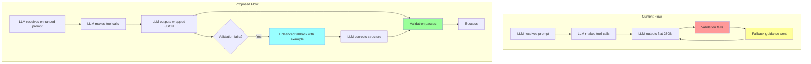

# Context Collection Schema Enforcement Plan

## Problem Summary

The Context Collection stage (Stage 4a) is experiencing persistent schema validation failures where the LLM produces JSON output with an incorrect structure, ignoring the required wrapper schema that includes `primary_function` as a top-level key.

### Evidence from Log Analysis

From `/Users/sgurivireddy/Desktop/log.txt` and `/Users/sgurivireddy/llm_artifacts/almanacapps/prompts_sent/6/step1_context_collection.md`:

```
2026-04-16 17:04:58,261 - [ContextCollectionAnalyzer] Found dict without 'primary_function' key - using as fallback
2026-04-16 17:04:58,261 - [ContextCollectionAnalyzer] Found JSON but failed shape validator in iteration 17 — got dict with keys: ['function_name', 'file', 'start_line', 'end_line', 'code'] — continuing
```

This pattern repeats in iterations 17, 18, 19, and 20 until max iterations is reached.

### The Schema Mismatch

| Aspect | Expected Schema | LLM Output |
|--------|-----------------|------------|
| Top-level structure | `{"schema_version": "1.0", "primary_function": {...}, "callees": [], ...}` | `{"function_name": "...", "file": "...", "start_line": ..., "end_line": ..., "code": "..."}` |
| Required top-level key | `primary_function` | Missing - flat structure |
| Wrapper | Full context bundle | Just the function data |

---

## Root Cause Analysis

### 1. Prompt Structure Issue
The current prompt in [`contextCollectionProcess.md`](../hindsight/core/prompts/contextCollectionProcess.md) has the schema specification, but:
- The schema is buried in a large document with many instructions
- The LLM gets distracted by tool-calling instructions and forgets the output format
- The critical reminder at the end (lines 270-289) is good but may not be prominent enough

### 2. Conversation Context Pollution
From the logged conversation, the LLM:
1. Starts by making `lookup_knowledge` tool calls (correct behavior)
2. Then makes `getFileContentByLines` tool calls (correct behavior)
3. Then tries to call `store_knowledge` with a nested JSON structure
4. Eventually outputs a flat JSON structure that matches the `store_knowledge` value format, not the context bundle format

**Key Insight**: The LLM appears to confuse the `store_knowledge` value format with the final output format.

### 3. Fallback Guidance Insufficient
The current fallback guidance in [`context_collection_analyzer.py:121-127`](../hindsight/core/llm/iterative/context_collection_analyzer.py:121):
```python
def get_fallback_guidance(self) -> str:
    return (
        "CRITICAL: Your previous response did not contain a valid context bundle. "
        "You MUST respond with ONLY a valid JSON context bundle object. "
        "Your response MUST start with `{` and end with `}`. "
        "The JSON object MUST contain a 'primary_function' key. "
        "No markdown, no arrays, no prose. Return the JSON object now."
    )
```

This guidance tells the LLM what key is needed but doesn't show the full structure.

---

## Solution Architecture



---

## Implementation Plan

### Phase 1: Enhance the System Prompt

#### 1.1 Add Prominent Schema Reminder at Start

Add a new section immediately after the ROLE section in [`contextCollectionProcess.md`](../hindsight/core/prompts/contextCollectionProcess.md):

**Location**: After line 6, before line 8

```markdown
---

## OUTPUT SCHEMA PREVIEW - READ THIS FIRST

Your final output MUST be a JSON object with this EXACT top-level structure:

```json
{
  "schema_version": "1.0",
  "primary_function": { ... },
  "callees": [ ... ],
  "callers": [ ... ],
  "data_types": [ ... ],
  "constants_and_globals": [ ... ],
  "knowledge_cache_hits": [ ... ],
  "collection_notes": [ ... ]
}
```

The `primary_function` key is MANDATORY. Do NOT output a flat structure like `{"function_name": "...", "file": "..."}`.

---
```

#### 1.2 Strengthen the Critical Final Reminder

Replace the existing CRITICAL FINAL REMINDER section (lines 270-289) with a more explicit version:

```markdown
---

## CRITICAL FINAL REMINDER

**Your entire response must be valid JSON matching the schema above.**

### Output Checklist - Verify Before Responding:
- [ ] Response starts with `{` and ends with `}`
- [ ] Top-level key `schema_version` is present with value `"1.0"`
- [ ] Top-level key `primary_function` is present and contains an object
- [ ] `primary_function` object has: `function_name`, `file_path`, `file_name`, `start_line`, `end_line`, `source`
- [ ] Top-level keys `callees`, `callers`, `data_types`, `constants_and_globals` are present as arrays

### ❌ WRONG - This will FAIL validation:
```json
{"function_name": "MyClass::myMethod", "file": "src/MyClass.swift", "start_line": 45, "end_line": 80, "code": "..."}
```

### ✅ CORRECT - This is the REQUIRED structure:
```json
{
  "schema_version": "1.0",
  "primary_function": {
    "function_name": "MyClass::myMethod",
    "class_name": "MyClass",
    "file_path": "src/MyClass.swift",
    "file_name": "MyClass.swift",
    "language": "swift",
    "start_line": 45,
    "end_line": 80,
    "source": "func myMethod() { ... }"
  },
  "callees": [],
  "callers": [],
  "data_types": [],
  "constants_and_globals": [],
  "knowledge_cache_hits": [],
  "collection_notes": []
}
```

**REMEMBER: The `primary_function` wrapper is NON-NEGOTIABLE. Any response without it will be rejected.**
```

### Phase 2: Enhance Fallback Guidance

#### 2.1 Update `get_fallback_guidance()` in `context_collection_analyzer.py`

Replace the current implementation with a more detailed version that includes an example:

```python
def get_fallback_guidance(self) -> str:
    """
    Get context collection-specific guidance for JSON output.
    
    Returns:
        Guidance message for producing a context bundle
    """
    return (
        "CRITICAL: Your previous response did not contain a valid context bundle.\n\n"
        "You MUST respond with a JSON object that has 'primary_function' as a TOP-LEVEL key.\n\n"
        "WRONG format (will fail):\n"
        '{"function_name": "...", "file": "...", "start_line": ..., "code": "..."}\n\n'
        "CORRECT format (required):\n"
        '{"schema_version": "1.0", "primary_function": {"function_name": "...", "file_path": "...", '
        '"file_name": "...", "start_line": ..., "end_line": ..., "source": "..."}, '
        '"callees": [], "callers": [], "data_types": [], "constants_and_globals": [], '
        '"knowledge_cache_hits": [], "collection_notes": []}\n\n'
        "Your response MUST start with '{' and end with '}'. "
        "Return the JSON context bundle NOW with 'primary_function' at the top level."
    )
```

### Phase 3: Add Schema Auto-Correction

#### 3.1 Add `_try_wrap_flat_json()` method to `context_collection_analyzer.py`

Add a method that attempts to wrap a flat JSON structure into the expected schema:

```python
def _try_wrap_flat_json(self, parsed_json: Dict[str, Any]) -> Optional[Dict[str, Any]]:
    """
    Attempt to wrap a flat JSON structure into the expected context bundle schema.
    
    If the LLM returns a flat structure like:
    {"function_name": "...", "file": "...", "start_line": ..., "end_line": ..., "code": "..."}
    
    This method wraps it into:
    {"schema_version": "1.0", "primary_function": {...}, "callees": [], ...}
    
    Args:
        parsed_json: The flat JSON dict from the LLM
        
    Returns:
        Wrapped context bundle dict, or None if wrapping is not possible
    """
    # Check if this looks like a flat function structure
    flat_function_keys = {'function_name', 'file', 'start_line', 'end_line', 'code'}
    alt_flat_keys = {'function_name', 'file_path', 'start_line', 'end_line', 'source'}
    
    json_keys = set(parsed_json.keys())
    
    if not (flat_function_keys.issubset(json_keys) or alt_flat_keys.issubset(json_keys)):
        return None
    
    logger.warning("[ContextCollectionAnalyzer] Attempting to auto-wrap flat JSON into context bundle schema")
    
    # Normalize field names
    primary_function = {}
    
    # Map common variations
    field_mappings = {
        'function_name': 'function_name',
        'name': 'function_name',
        'file': 'file_path',
        'file_path': 'file_path',
        'start_line': 'start_line',
        'startLine': 'start_line',
        'end_line': 'end_line',
        'endLine': 'end_line',
        'code': 'source',
        'source': 'source',
        'class_name': 'class_name',
        'className': 'class_name',
    }
    
    for src_key, dest_key in field_mappings.items():
        if src_key in parsed_json:
            primary_function[dest_key] = parsed_json[src_key]
    
    # Extract file_name from file_path if not present
    if 'file_path' in primary_function and 'file_name' not in primary_function:
        import os
        primary_function['file_name'] = os.path.basename(primary_function['file_path'])
    
    # Infer language from file extension
    if 'file_name' in primary_function and 'language' not in primary_function:
        ext_to_lang = {
            '.swift': 'swift', '.m': 'objc', '.mm': 'objc',
            '.py': 'python', '.java': 'java', '.kt': 'kotlin',
            '.js': 'javascript', '.ts': 'typescript',
            '.c': 'c', '.cpp': 'cpp', '.h': 'c', '.hpp': 'cpp'
        }
        import os
        _, ext = os.path.splitext(primary_function['file_name'])
        primary_function['language'] = ext_to_lang.get(ext.lower(), 'unknown')
    
    # Build the wrapped context bundle
    wrapped = {
        'schema_version': '1.0',
        'primary_function': primary_function,
        'callees': parsed_json.get('callees', []),
        'callers': parsed_json.get('callers', []),
        'data_types': parsed_json.get('data_types', []),
        'constants_and_globals': parsed_json.get('constants_and_globals', []),
        'knowledge_cache_hits': parsed_json.get('knowledge_cache_hits', []),
        'collection_notes': ['Auto-wrapped from flat JSON structure by ContextCollectionAnalyzer']
    }
    
    logger.info("[ContextCollectionAnalyzer] Successfully auto-wrapped flat JSON into context bundle schema")
    return wrapped
```

#### 3.2 Update `extract_json()` to use auto-wrapping

Modify the fallback logic in `extract_json()` to attempt auto-wrapping:

```python
def extract_json(self, content: str) -> Optional[str]:
    """
    Extract context bundle JSON from LLM response.
    
    Searches for dict with 'primary_function' key.
    If not found, attempts to auto-wrap flat JSON structures.
    """
    candidates = self._find_all_json_objects(content)
    
    # Find first dict with 'primary_function' key (candidates are sorted by size, largest first)
    for candidate in candidates:
        try:
            parsed = json.loads(candidate)
            if isinstance(parsed, dict) and 'primary_function' in parsed:
                logger.info("[ContextCollectionAnalyzer] Found context bundle with 'primary_function' key")
                return candidate
        except json.JSONDecodeError:
            continue
    
    # Fallback: try to auto-wrap flat JSON structures
    for candidate in candidates:
        try:
            parsed = json.loads(candidate)
            if isinstance(parsed, dict):
                wrapped = self._try_wrap_flat_json(parsed)
                if wrapped:
                    logger.info("[ContextCollectionAnalyzer] Auto-wrapped flat JSON into context bundle")
                    return json.dumps(wrapped)
        except json.JSONDecodeError:
            continue
    
    # Last resort: any dict (might be partial or different structure)
    for candidate in candidates:
        try:
            parsed = json.loads(candidate)
            if isinstance(parsed, dict):
                logger.warning("[ContextCollectionAnalyzer] Found dict without 'primary_function' key - using as fallback")
                return candidate
        except json.JSONDecodeError:
            continue
    
    # Check if there's an array that contains a dict with 'primary_function'
    array_candidates = self._find_all_json_arrays(content)
    for candidate in array_candidates:
        try:
            parsed = json.loads(candidate)
            if isinstance(parsed, list):
                for item in parsed:
                    if isinstance(item, dict) and 'primary_function' in item:
                        logger.warning("[ContextCollectionAnalyzer] Found context bundle wrapped in array - extracting")
                        return json.dumps(item)
        except json.JSONDecodeError:
            continue
    
    logger.warning("[ContextCollectionAnalyzer] No valid context bundle found")
    return None
```

### Phase 4: Add Iteration-Aware Guidance

#### 4.1 Add progressive urgency to fallback guidance

Update `get_fallback_guidance()` to accept an iteration parameter:

```python
def get_fallback_guidance(self, iteration: int = 0, max_iterations: int = 20) -> str:
    """
    Get context collection-specific guidance for JSON output.
    
    Args:
        iteration: Current iteration number
        max_iterations: Maximum allowed iterations
        
    Returns:
        Guidance message for producing a context bundle
    """
    remaining = max_iterations - iteration
    urgency = ""
    
    if remaining <= 3:
        urgency = f"⚠️ URGENT: Only {remaining} iteration(s) remaining! "
    elif remaining <= 5:
        urgency = f"WARNING: {remaining} iterations remaining. "
    
    return (
        f"{urgency}CRITICAL: Your previous response did not contain a valid context bundle.\n\n"
        "You MUST respond with a JSON object that has 'primary_function' as a TOP-LEVEL key.\n\n"
        "WRONG format (will fail):\n"
        '{"function_name": "...", "file": "...", "start_line": ..., "code": "..."}\n\n'
        "CORRECT format (required):\n"
        '{"schema_version": "1.0", "primary_function": {"function_name": "...", "file_path": "...", '
        '"file_name": "...", "start_line": ..., "end_line": ..., "source": "..."}, '
        '"callees": [], "callers": [], "data_types": [], "constants_and_globals": [], '
        '"knowledge_cache_hits": [], "collection_notes": []}\n\n'
        "Your response MUST start with '{' and end with '}'. "
        "Return the JSON context bundle NOW with 'primary_function' at the top level."
    )
```

#### 4.2 Update base_iterative_analyzer.py to pass iteration info

Modify the fallback guidance call in `run_iterative_analysis()` to pass iteration context:

```python
# In run_iterative_analysis(), around line 367:
# Check if get_fallback_guidance accepts iteration parameters
import inspect
sig = inspect.signature(self.get_fallback_guidance)
if 'iteration' in sig.parameters:
    guidance_message = self.get_fallback_guidance(iteration=iteration, max_iterations=max_iterations)
else:
    guidance_message = self.get_fallback_guidance()
```

---

## Files to Modify

| File | Changes |
|------|---------|
| [`hindsight/core/prompts/contextCollectionProcess.md`](../hindsight/core/prompts/contextCollectionProcess.md) | Add OUTPUT SCHEMA PREVIEW section after ROLE; enhance CRITICAL FINAL REMINDER |
| [`hindsight/core/llm/iterative/context_collection_analyzer.py`](../hindsight/core/llm/iterative/context_collection_analyzer.py) | Add `_try_wrap_flat_json()` method; update `extract_json()` to use auto-wrapping; enhance `get_fallback_guidance()` |
| [`hindsight/core/llm/iterative/base_iterative_analyzer.py`](../hindsight/core/llm/iterative/base_iterative_analyzer.py) | Update fallback guidance call to pass iteration info |

---

## Implementation Order

1. **Phase 1.1**: Add OUTPUT SCHEMA PREVIEW section to prompt (highest impact, lowest risk)
2. **Phase 1.2**: Enhance CRITICAL FINAL REMINDER section
3. **Phase 2.1**: Update `get_fallback_guidance()` with example
4. **Phase 3.1**: Add `_try_wrap_flat_json()` method
5. **Phase 3.2**: Update `extract_json()` to use auto-wrapping
6. **Phase 4.1-4.2**: Add iteration-aware guidance (optional enhancement)

---

## Testing Strategy

### Unit Tests

Add tests to `hindsight/tests/core/llm/iterative/test_context_collection_analyzer.py`:

```python
def test_extract_json_with_primary_function():
    """Test that extract_json finds JSON with primary_function key."""
    analyzer = ContextCollectionAnalyzer(mock_claude)
    content = '{"schema_version": "1.0", "primary_function": {"function_name": "test"}, "callees": []}'
    result = analyzer.extract_json(content)
    assert result is not None
    parsed = json.loads(result)
    assert 'primary_function' in parsed

def test_extract_json_auto_wraps_flat_structure():
    """Test that extract_json auto-wraps flat JSON structures."""
    analyzer = ContextCollectionAnalyzer(mock_claude)
    content = '{"function_name": "test", "file": "test.swift", "start_line": 1, "end_line": 10, "code": "..."}'
    result = analyzer.extract_json(content)
    assert result is not None
    parsed = json.loads(result)
    assert 'primary_function' in parsed
    assert parsed['primary_function']['function_name'] == 'test'

def test_validate_json_rejects_flat_structure():
    """Test that validate_json rejects flat structures."""
    analyzer = ContextCollectionAnalyzer(mock_claude)
    flat_json = {"function_name": "test", "file": "test.swift"}
    assert analyzer.validate_json(flat_json) == False

def test_validate_json_accepts_wrapped_structure():
    """Test that validate_json accepts properly wrapped structures."""
    analyzer = ContextCollectionAnalyzer(mock_claude)
    wrapped_json = {"schema_version": "1.0", "primary_function": {"function_name": "test"}}
    assert analyzer.validate_json(wrapped_json) == True
```

### Integration Tests

Run the code analysis pipeline on a sample function and verify:
1. The LLM produces JSON with `primary_function` at the top level
2. If the LLM produces flat JSON, it gets auto-wrapped
3. Iteration count decreases compared to before the fix
4. No "Found dict without 'primary_function' key" warnings in logs

---

## Success Criteria

1. **Primary**: The warning "Found dict without 'primary_function' key - using as fallback" should rarely appear
2. **Primary**: The log "Found JSON but failed shape validator" should not appear repeatedly
3. **Secondary**: Average iteration count for context collection should decrease
4. **Secondary**: Auto-wrapping should successfully recover from flat JSON outputs
5. **Monitoring**: Track the ratio of direct schema compliance vs auto-wrapped responses

---

## Rollback Plan

If the changes cause issues:
1. Revert the prompt changes in `contextCollectionProcess.md`
2. Revert the `_try_wrap_flat_json()` method (keep the enhanced fallback guidance)
3. The auto-wrapping is additive and can be disabled by removing the call in `extract_json()`

---

## Future Considerations

1. **Schema Validation Library**: Consider using a JSON Schema validator (like `jsonschema`) for more robust validation
2. **Prompt Optimization**: A/B test different prompt formulations to find the most effective schema enforcement
3. **Model-Specific Tuning**: Different LLM models may respond differently to schema instructions; consider model-specific prompts
4. **Metrics Dashboard**: Add metrics to track schema compliance rates over time
