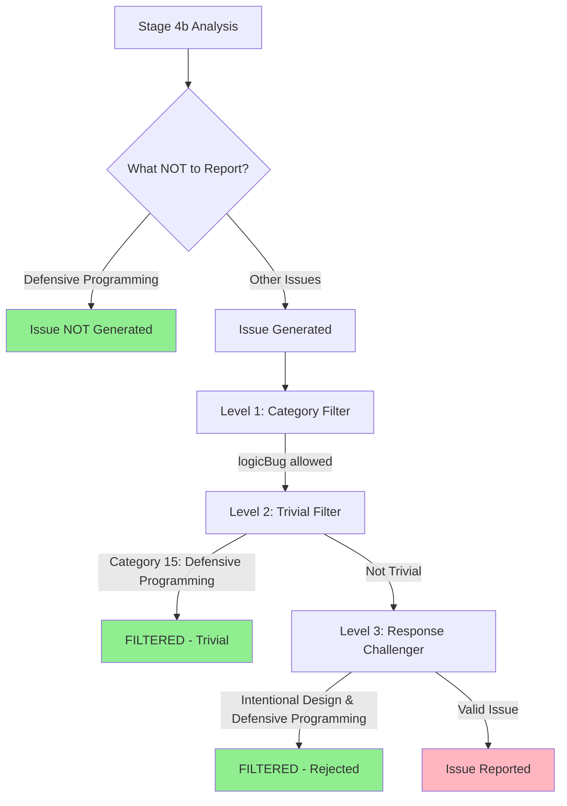

# Defensive Programming Filter Implementation Plan

## Overview

This plan implements the recommendations from `defensive_programming.md` to filter out issues that represent **defensive programming patterns** rather than actual bugs. These issues are technically valid but have low practical impact because they address edge cases unlikely to occur given domain constraints.

## Problem Statement

The code analyzer is reporting issues like:
1. **"DeviceType.Unknown case is never returned"** - Unused enum case; domain only has iPhone and Watch
2. **"Comparison function returns true when comparing identical iPhone devices"** - Code comment says "there can only be one phone"

These issues share a common pattern: **technically imperfect code that works correctly given domain constraints**.

### Root Cause Analysis

| Filter Level | Why It Passed |
|--------------|---------------|
| **Level 1** (Category) | Categorized as `logicBug` which is in allowlist |
| **Level 2** (Trivial) | No criteria for "unused enum cases" or "domain-constrained edge cases" |
| **Level 3** (Challenger) | Issues ARE technically valid; lacks criteria for **practical impact** vs **theoretical correctness** |

---

## Implementation Plan

### Option A: Level 2 Filter - trivialIssueFilterPrompt.md (RECOMMENDED - Highest Priority)

**File:** [`hindsight/core/prompts/trivialIssueFilterPrompt.md`](hindsight/core/prompts/trivialIssueFilterPrompt.md)

**Changes Required:**

#### 1. Add Category #15 (after line 26)

Add a new trivial category after the existing 14 categories:

```markdown
15. **Defensive Programming**: Unused enum cases, unreachable default branches, or edge cases prevented by documented domain constraints (e.g., comments like "only one", "by design", "defensive")
```

#### 2. Add Field Hints (after line 35)

Add new field hints for defensive programming patterns:

```markdown
- If issue mentions "unused enum", "never returned", "unreachable" with domain constraints → likely TRIVIAL
- If issue mentions "defensive", "by design", "intentional", "only one" in comments → likely TRIVIAL
```

#### 3. Update Question Reference (line 39-41)

Update the question to reference 15 categories instead of 14:

```markdown
Answer this question by providing true or false based on whether the issue matches any of the 15 trivial categories listed above.
```

#### 4. Update Response Format (line 65)

Update the response format to reference 15 categories:

```markdown
- Use `"result": true` if the issue IS trivial (matches any of the 15 categories above)
```

#### 5. Add Examples (after line 137)

Add examples for defensive programming:

```markdown
**Example 15 - Trivial Issue (Defensive Programming - Unused Enum)**
Input: {"issue": "Status.Unknown enum case is never used", "description": "The Unknown enum case is defined but never returned by any function in the codebase", "category": "logicBug"}
Response: {"result": true}

**Example 16 - Trivial Issue (Defensive Programming - Domain Constraint)**
Input: {"issue": "Equality check always returns true for singleton objects", "description": "The comparison logic assumes there is only one instance, as documented in comments stating 'singleton by design'", "category": "logicBug"}
Response: {"result": true}

**Example 17 - Trivial Issue (Defensive Programming - Unreachable Default)**
Input: {"issue": "Default case in switch statement is unreachable", "description": "All enum values are explicitly handled, making the default case unreachable but kept for defensive programming", "category": "logicBug"}
Response: {"result": true}
```

---

### Option B: Response Challenger - responseChallenger.md (Medium Priority)

**File:** [`hindsight/core/prompts/responseChallenger.md`](hindsight/core/prompts/responseChallenger.md)

**Changes Required:**

#### 1. Enhance "Intentional Design Patterns" Section (lines 153-158)

The existing prompt already has an "Intentional Design Patterns" section. Rather than adding a separate validation question, we will **enhance this existing section** to include more specific defensive programming criteria:

**Current content (lines 153-158):**
```markdown
### Intentional Design Patterns
- The pattern appears intentional for API consistency, backward compatibility, or future extensibility
- Comments in the code indicate the behavior is by design ("intentional", "by design", "defensive", "shouldn't happen", "expected")
- The pattern follows established conventions for the codebase or domain
- Defensive programming patterns are being flagged as bugs
```

**Updated content:**
```markdown
### Intentional Design Patterns & Defensive Programming
- The pattern appears intentional for API consistency, backward compatibility, or future extensibility
- Comments in the code indicate the behavior is by design ("intentional", "by design", "defensive", "shouldn't happen", "expected", "only one")
- The pattern follows established conventions for the codebase or domain
- Defensive programming patterns are being flagged as bugs
- Unused enum cases or unreachable default branches that exist for completeness or future extensibility
- Edge cases that are prevented by documented domain constraints (e.g., "there can only be one phone")
- Code that handles theoretically possible but practically impossible scenarios given the domain
```

#### 2. Add Corresponding Validation Question (after line 189)

Add a validation question that references the enhanced section:

```markdown
10. **Is this intentional design or defensive programming?** - Does the code have comments indicating intentional design ("by design", "only one", "defensive", "intentional")? Are there unused enum cases or unreachable defaults for future extensibility? Is the edge case prevented by domain constraints? If YES, reject.
```

---

### Option C: Stage 4b System Prompt - analysisProcess.md (Medium Priority)

**File:** [`hindsight/core/prompts/analysisProcess.md`](hindsight/core/prompts/analysisProcess.md)

**Changes Required:**

#### 1. Add to "What NOT to Report" Section (after line 138)

Add a new bullet point:

```markdown
- Defensive programming (unused enum cases, unreachable defaults, edge cases prevented by domain constraints or marked intentional in comments)
```

---

## Files to Modify

| File | Change Type | Priority |
|------|-------------|----------|
| [`hindsight/core/prompts/trivialIssueFilterPrompt.md`](hindsight/core/prompts/trivialIssueFilterPrompt.md:11) | Add category #15, field hints, examples | High |
| [`hindsight/core/prompts/responseChallenger.md`](hindsight/core/prompts/responseChallenger.md:153) | Enhance "Intentional Design Patterns" section + add validation question #10 | Medium |
| [`hindsight/core/prompts/analysisProcess.md`](hindsight/core/prompts/analysisProcess.md:127) | Add to "What NOT to Report" | Medium |

---

## Testing Plan

### Unit Tests

Add test cases to [`hindsight/tests/issue_filter/`](hindsight/tests/issue_filter/) for:

1. **Unused enum case detection**
   - Input: Issue about unused enum case
   - Expected: Filtered as trivial

2. **Domain-constrained edge case detection**
   - Input: Issue about edge case with "only one" or "by design" comments
   - Expected: Filtered as trivial

3. **Unreachable default branch detection**
   - Input: Issue about unreachable default/switch case
   - Expected: Filtered as trivial

### Integration Test

Re-run analysis on almanacapps repository and verify:
1. "DeviceType.Unknown case is never returned" → Filtered at Level 2
2. "Comparison function returns true when comparing identical iPhone devices" → Filtered at Level 2 or 3

---

## Implementation Order

1. **Option A** - Level 2 Filter (catches issues early, highest impact)
2. **Option C** - Stage 4b Prompt (prevents generation of these issues)
3. **Option B** - Response Challenger (adds validation layer)

This order ensures issues are caught at the earliest possible stage while also preventing them from being generated in the first place.

---

## Mermaid Diagram: Issue Filtering Pipeline



---

## Success Criteria

After implementation:
- [ ] "DeviceType.Unknown case is never returned" is filtered
- [ ] "Comparison function returns true when comparing identical iPhone devices" is filtered
- [ ] No regression in detection of legitimate logic bugs
- [ ] All existing tests pass
- [ ] New test cases for defensive programming patterns pass
