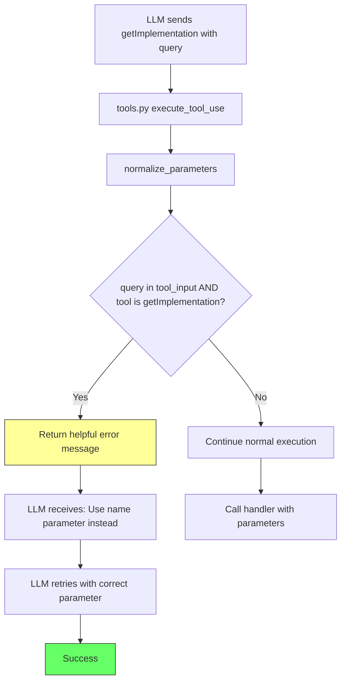

# Bug Fix Plan: LLM Incorrectly Invoking getImplementation with `query` Parameter

## Problem Statement

The LLM is invoking the `getImplementation` tool with a `query` parameter instead of the expected `name` parameter, causing the error:

```
_handle_get_implementation() got an unexpected keyword argument 'query'
```

## Root Cause Analysis

### 1. Parameter Confusion Between Tools

The issue stems from parameter naming confusion between two similar tools:

| Tool | Primary Parameter | Purpose |
|------|-------------------|---------|
| `lookup_knowledge` | `query` | Search the knowledge base |
| `getImplementation` | `name` | Retrieve class/function implementation |

The LLM is confusing these two tools because:
1. Both tools are used to "look up" or "retrieve" information
2. The `lookup_knowledge` tool has aliases that map `name` → `query` (see [`tool_definitions.py:197`](hindsight/core/llm/tools/tool_definitions.py:197))
3. The prompt documentation emphasizes using `lookup_knowledge` FIRST before other tools

### 2. Code Flow Analysis

When the LLM sends a tool request like:
```json
{
  "tool": "getImplementation",
  "query": "SomeClassName",
  "reason": "Need to understand the implementation"
}
```

The execution flow is:
1. [`base_iterative_analyzer.py:469-475`](hindsight/core/llm/iterative/base_iterative_analyzer.py:469) - Converts JSON to tool_use format
2. [`tools.py:279`](hindsight/core/llm/tools/tools.py:279) - Calls `normalize_parameters()` to handle aliases
3. [`tool_definitions.py:265-284`](hindsight/core/llm/tools/tool_definitions.py:265) - `normalize_parameters()` only converts KNOWN aliases
4. [`tools.py:286`](hindsight/core/llm/tools/tools.py:286) - Calls handler with `**normalized_input`
5. [`tools.py:173-175`](hindsight/core/llm/tools/tools.py:173) - `_handle_get_implementation()` receives unexpected `query` kwarg

### 3. Why normalize_parameters Does Not Help

The `normalize_parameters()` function in [`tool_definitions.py:265-284`](hindsight/core/llm/tools/tool_definitions.py:265) only converts aliases that are explicitly defined for each tool:

```python
# getImplementation aliases (line 150-153):
"aliases": {
    "class_name": "name",
    "function_name": "name"
}
```

`query` is NOT an alias for `getImplementation`, so it passes through unchanged and causes the error.

## Implementation Plan

### Change 1: Add Helpful Error Message in tools.py

**File:** [`hindsight/core/llm/tools/tools.py`](hindsight/core/llm/tools/tools.py)

**Location:** In the `execute_tool_use()` method, add parameter confusion detection before calling handlers.

**Code Change:**

Add this check after line 280 (after `normalize_parameters` call) and before line 283 (before handler execution):

```python
# Detect common parameter confusion and return helpful error message
if tool_name == "getImplementation" and "query" in tool_input:
    return (
        "Error: getImplementation requires 'name' parameter, not 'query'. "
        "Use: {\"tool\": \"getImplementation\", \"name\": \"" + str(tool_input.get("query", "")) + "\"}"
    )
```

This provides a clear, actionable error message that tells the LLM exactly how to fix the tool call.

### Change 2: Update Prompt Documentation in analysisTools.md

**File:** [`hindsight/core/prompts/analysisTools.md`](hindsight/core/prompts/analysisTools.md)

**Location:** Update the `getImplementation Tool` section (around line 182-198)

**Changes:**

1. Add a clear parameter warning after the tool description
2. Add explicit parameter documentation

**Updated Section:**

```markdown
### getImplementation Tool
**Purpose**: Retrieve the complete implementation of a class, struct or enum from ALL associated files
**Usage**: Whenever you need to understand any class, struct, or enum. This tool automatically finds and reads all relevant files for a class.
**Advantages**: More efficient than multiple readFile calls, provides complete context, includes all related files

**⚠️ PARAMETER WARNING**: This tool uses `name` parameter, NOT `query`. The `query` parameter is only for `lookup_knowledge`.

**Example Usage**:
```json
{
  "tool": "getImplementation",
  "name": "TMTimeSynthesizer",
  "reason": "Need to understand the complete implementation of TMTimeSynthesizer class to analyze its logic and behavior"
}
```

**Parameters**:
- `name`: (required) Name of the class, struct, enum, or function to retrieve
- `reason`: (optional) Explanation for why this implementation is needed

**⚠️ CRITICAL**:  `name` parameter must be provided (NOT `query`)
```

## Files to Modify

| File | Change | Description |
|------|--------|-------------|
| [`hindsight/core/llm/tools/tools.py`](hindsight/core/llm/tools/tools.py) | Add error detection | Return helpful error when `query` is used with `getImplementation` |
| [`hindsight/core/prompts/analysisTools.md`](hindsight/core/prompts/analysisTools.md) | Update documentation | Add parameter warning and explicit parameter list |

## Architecture Diagram



## Verification Steps

After implementing fixes:

1. Run the same analysis that produced the error
2. Verify the LLM receives a helpful error message instead of a stack trace
3. Verify the LLM can self-correct and retry with the correct `name` parameter
4. Check logs to confirm the error message is being returned
