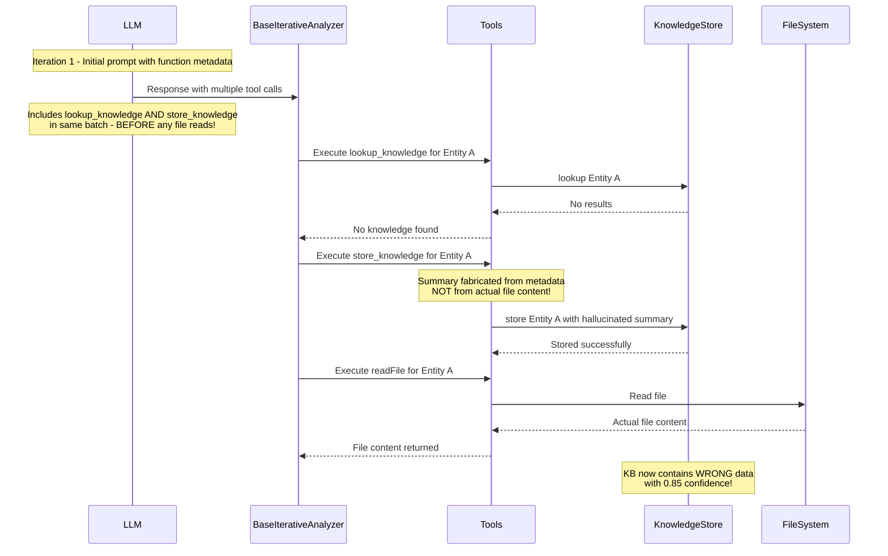
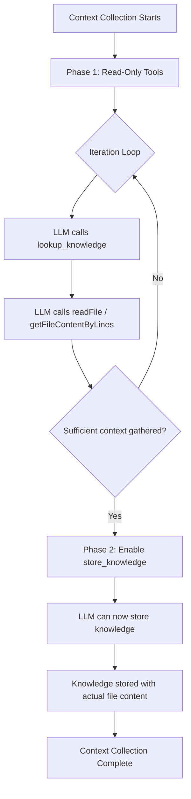

# Knowledge Base Hallucination Fix Plan

## Problem Statement

The Knowledge Base is storing **hallucinated content** because the LLM fires all `lookup_knowledge` and `store_knowledge` calls in the **same batch** during iteration 1, before any file reads have completed. This means summaries are fabricated from priors and call tree metadata — not from actual file content.

### Concrete Examples from Analysis

| Entity | Stored Summary | Reality |
|--------|----------------|---------|
| `DataCollector::stopRecording` | Simple reader lookup + `reader.stopRecording()` | 56-line switch statement, 20+ sensor type cases, `fatalError` on default |
| `SensorIdentifier` | Described as `struct` | Actually an `enum` with `String` raw values |
| `DataCollector` | Described as `class` | Actually an `actor` |
| `SensorDataStorage::removeSensor` | Simple nil-setter | Calls 5 `persist*()` methods after clearing dicts — persists to UserDefaults |
| `DataCollector::stopRecording` (file) | 0.85 confidence summary stored | File `DataCollector+Recording.swift` returned ERROR (not found) |

### Impact

Any future function that gets a `confidence ≥ 0.8` KB hit on these entries will reason from wrong premises. For concurrency analysis in particular, `class` vs `actor` is a critical distinction — actor isolation changes what races are possible.

---

## Root Cause Analysis



### The Problem Flow

1. LLM receives initial prompt with function metadata (call tree, type names, etc.)
2. In its **first response**, LLM generates multiple tool calls including:
   - `lookup_knowledge` calls (correct - checking for existing knowledge)
   - `store_knowledge` calls (WRONG - storing summaries before reading files)
   - `readFile` calls (correct - but executed AFTER store_knowledge)
3. The `store_knowledge` calls contain summaries fabricated from metadata/priors
4. These hallucinated summaries get persisted with high confidence (0.85)
5. Future analyses trust these wrong summaries

---

## Solution: Approach C - Two-Phase Tool Availability

Remove `store_knowledge` from the initial tool set and only enable it after sufficient context has been gathered (i.e., after file reads have occurred).

### Design Overview



### Phase Transition Criteria

The system transitions from Phase 1 to Phase 2 when:
1. **Minimum iterations reached**: At least N iterations have passed (e.g., N=2)
2. **File reads occurred**: At least one successful file read has completed
3. **OR explicit trigger**: LLM requests to store knowledge (triggers phase transition)

### Key Benefits

1. **Prevents premature storage**: `store_knowledge` is simply not available in early iterations
2. **Natural flow**: LLM must read files first because that's all it can do
3. **Clear separation**: Read phase vs. Write phase
4. **Simple implementation**: Just modify the supported_tools list dynamically

---

## Implementation Plan

### Phase 1: Add Phase Tracking to Tools Class

**File:** [`hindsight/core/llm/tools/tools.py`](hindsight/core/llm/tools/tools.py:60-110)

```python
class Tools:
    def __init__(self, ...):
        # ... existing init code ...
        
        # NEW: Phase tracking for two-phase tool availability
        self._current_phase: int = 1  # 1 = read-only, 2 = full access
        self._iteration_count: int = 0
        self._file_reads_count: int = 0
        self._min_iterations_for_phase2: int = 2
        self._min_file_reads_for_phase2: int = 1
    
    def reset_phase_tracking(self):
        """Reset phase tracking for a new analysis session."""
        self._current_phase = 1
        self._iteration_count = 0
        self._file_reads_count = 0
        logger.info("[PHASE] Reset to Phase 1 (read-only)")
    
    def increment_iteration(self):
        """Called at the start of each iteration."""
        self._iteration_count += 1
        self._check_phase_transition()
    
    def record_file_read(self):
        """Called when a file read completes successfully."""
        self._file_reads_count += 1
        self._check_phase_transition()
    
    def _check_phase_transition(self):
        """Check if conditions are met to transition to Phase 2."""
        if self._current_phase == 1:
            if (self._iteration_count >= self._min_iterations_for_phase2 and 
                self._file_reads_count >= self._min_file_reads_for_phase2):
                self._current_phase = 2
                logger.info(
                    f"[PHASE] Transitioned to Phase 2 (full access) - "
                    f"iterations={self._iteration_count}, file_reads={self._file_reads_count}"
                )
    
    def is_store_knowledge_enabled(self) -> bool:
        """Check if store_knowledge is currently enabled."""
        return self._current_phase >= 2
    
    def get_phase_status(self) -> dict:
        """Get current phase status for debugging."""
        return {
            "phase": self._current_phase,
            "iteration_count": self._iteration_count,
            "file_reads_count": self._file_reads_count,
            "store_knowledge_enabled": self.is_store_knowledge_enabled()
        }
```

### Phase 2: Modify store_knowledge Handler

**File:** [`hindsight/core/llm/tools/knowledge_tools.py`](hindsight/core/llm/tools/knowledge_tools.py:73-116)

```python
def execute_store_knowledge_tool(
    self,
    entity_key: str,
    summary: str,
    related_context: Optional[str] = None,
    confidence: float = 0.8,
    stage: str = "context",
) -> str:
    """Execute store_knowledge tool with phase validation."""
    if self.knowledge_store is None:
        return "Knowledge base not available"
    
    # NEW: Check if store_knowledge is enabled in current phase
    if not self.is_store_knowledge_enabled():
        logger.info(
            f"[KB] store_knowledge DEFERRED for {entity_key} - "
            f"Phase 1 active (read-only). Read files first, then store knowledge."
        )
        return (
            f"store_knowledge is not yet available. "
            f"You are in Phase 1 (context gathering). "
            f"First, read the relevant files using readFile or getFileContentByLines. "
            f"After reading files, store_knowledge will become available. "
            f"Current status: {self._file_reads_count} file(s) read, "
            f"need at least {self._min_file_reads_for_phase2}."
        )
    
    # Existing store logic...
    try:
        success = self.knowledge_store.store(
            entity_key,
            summary,
            related_context,
            confidence,
            stage,
        )
    except Exception as exc:
        logger.error(
            "store_knowledge raised exception for entity_key=%r: %s",
            entity_key,
            exc,
            exc_info=True,
        )
        return f"Failed to store knowledge for {entity_key}"

    if success:
        logger.info(f"[KB] store_knowledge({entity_key}) -> stored (confidence={confidence})")
        return f"Stored knowledge for {entity_key}"
    return f"Failed to store knowledge for {entity_key}"
```

### Phase 3: Track File Reads in File Tools

**File:** [`hindsight/core/llm/tools/file_tools.py`](hindsight/core/llm/tools/file_tools.py)

```python
def execute_read_file_tool(self, path: str) -> str:
    """Execute readFile tool with phase tracking."""
    result = self._read_file_impl(path)
    
    # Track successful reads for phase transition
    if not result.startswith("Error:"):
        self.record_file_read()
        logger.debug(f"[PHASE] File read recorded: {path}")
    
    return result

def execute_get_file_content_by_lines_tool(
    self, path: str, start_line: int, end_line: int, reason: str = None
) -> str:
    """Execute getFileContentByLines tool with phase tracking."""
    result = self._get_file_content_by_lines_impl(path, start_line, end_line)
    
    # Track successful reads for phase transition
    if not result.startswith("Error:"):
        self.record_file_read()
        logger.debug(f"[PHASE] File read recorded: {path} (lines {start_line}-{end_line})")
    
    return result
```

### Phase 4: Integrate with Iterative Analyzer

**File:** [`hindsight/core/llm/iterative/base_iterative_analyzer.py`](hindsight/core/llm/iterative/base_iterative_analyzer.py:153-400)

```python
def run_iterative_analysis(
    self,
    system_prompt: str,
    user_prompt: str,
    tools_executor: Any = None,
    supported_tools: List[str] = None,
    # ... other params ...
) -> Optional[str]:
    """Run iterative analysis with two-phase tool availability."""
    
    # ... existing setup code ...
    
    while iteration < max_iterations:
        iteration += 1
        
        # NEW: Increment iteration count for phase tracking
        if tools_executor and hasattr(tools_executor, 'tools'):
            tools_executor.tools.increment_iteration()
        
        # ... rest of existing iteration logic ...
```

### Phase 5: Reset Phase at Session Start

**File:** [`hindsight/core/llm/code_analysis.py`](hindsight/core/llm/code_analysis.py:539-700)

```python
def run_context_collection(self, json_data: dict, checksum: str) -> Optional[dict]:
    """Context Collection: Collect code context for the given function."""
    logger.info(f"Context Collection: Starting for checksum {checksum[:8]}...")
    
    # NEW: Reset phase tracking for fresh analysis
    self.tools.reset_phase_tracking()
    
    # ... rest of existing code ...
```

### Phase 6: Update Prompt Documentation

**File:** [`hindsight/core/prompts/contextCollectionProcess.md`](hindsight/core/prompts/contextCollectionProcess.md)

Add section explaining the two-phase system:

```markdown
## TWO-PHASE TOOL AVAILABILITY

The context collection process operates in two phases:

### Phase 1: Context Gathering (Read-Only)
- Available tools: `lookup_knowledge`, `readFile`, `getFileContentByLines`, `list_files`, `getSummaryOfFile`, `checkFileSize`, `runTerminalCmd`
- `store_knowledge` is **NOT available** in this phase
- Focus on reading and understanding the code

### Phase 2: Knowledge Storage (Full Access)
- All tools available including `store_knowledge`
- Activated after you have read at least one file
- Now you can store summaries based on actual file content

### Why This Matters
This two-phase approach ensures that any knowledge you store is based on **actual file content** you have read, not assumptions or metadata. This prevents storing incorrect summaries that could mislead future analyses.

### Workflow
1. Start in Phase 1 - read files to gather context
2. System automatically transitions to Phase 2 after file reads
3. In Phase 2, store knowledge based on what you actually read
```

---

## Configuration Options

Add constants to control phase transition behavior:

**File:** [`hindsight/core/constants.py`](hindsight/core/constants.py)

```python
# Two-phase tool availability settings
MIN_ITERATIONS_FOR_STORE_KNOWLEDGE = 2  # Minimum iterations before store_knowledge enabled
MIN_FILE_READS_FOR_STORE_KNOWLEDGE = 1  # Minimum file reads before store_knowledge enabled
```

---

## Testing Strategy

### Unit Tests

**File:** `hindsight/tests/core/llm/tools/test_two_phase_tools.py`

```python
import pytest
from hindsight.core.llm.tools.tools import Tools

class TestTwoPhaseToolAvailability:
    
    def test_initial_phase_is_one(self):
        """Tools should start in Phase 1."""
        tools = Tools(repo_path="/test/repo", knowledge_store=mock_kb)
        assert tools._current_phase == 1
        assert not tools.is_store_knowledge_enabled()
    
    def test_store_knowledge_blocked_in_phase_one(self):
        """store_knowledge should return guidance message in Phase 1."""
        tools = Tools(repo_path="/test/repo", knowledge_store=mock_kb)
        
        result = tools.execute_store_knowledge_tool(
            entity_key="MyClass@MyFile.swift",
            summary="Some summary"
        )
        
        assert "not yet available" in result
        assert "Phase 1" in result
    
    def test_phase_transition_after_file_reads(self):
        """Phase should transition to 2 after sufficient file reads."""
        tools = Tools(repo_path="/test/repo", knowledge_store=mock_kb)
        
        # Simulate iterations and file reads
        tools.increment_iteration()
        tools.increment_iteration()
        tools.record_file_read()
        
        assert tools._current_phase == 2
        assert tools.is_store_knowledge_enabled()
    
    def test_store_knowledge_works_in_phase_two(self):
        """store_knowledge should work after phase transition."""
        tools = Tools(repo_path="/test/repo", knowledge_store=mock_kb)
        
        # Transition to Phase 2
        tools.increment_iteration()
        tools.increment_iteration()
        tools.record_file_read()
        
        result = tools.execute_store_knowledge_tool(
            entity_key="MyClass@MyFile.swift",
            summary="Actual summary from file content"
        )
        
        assert "Stored knowledge" in result
    
    def test_phase_reset_between_sessions(self):
        """Phase should reset when starting new analysis."""
        tools = Tools(repo_path="/test/repo", knowledge_store=mock_kb)
        
        # Transition to Phase 2
        tools.increment_iteration()
        tools.increment_iteration()
        tools.record_file_read()
        assert tools._current_phase == 2
        
        # Reset
        tools.reset_phase_tracking()
        assert tools._current_phase == 1
        assert not tools.is_store_knowledge_enabled()
    
    def test_file_read_tracking(self):
        """File reads should be counted correctly."""
        tools = Tools(repo_path="/test/repo", knowledge_store=mock_kb)
        
        assert tools._file_reads_count == 0
        tools.record_file_read()
        assert tools._file_reads_count == 1
        tools.record_file_read()
        assert tools._file_reads_count == 2
```

### Integration Tests

1. Run full context collection on a function
2. Verify `store_knowledge` is blocked in early iterations
3. Verify `store_knowledge` works after file reads
4. Verify stored knowledge matches actual file content

---

## Rollout Plan

### Week 1: Implementation
- Implement phase tracking in Tools class
- Modify store_knowledge handler
- Add file read tracking
- Update prompts

### Week 2: Testing
- Run unit tests
- Run integration tests on sample functions
- Verify LLM adapts to two-phase system

### Week 3: Monitoring
- Deploy to staging
- Monitor phase transition logs
- Verify no hallucinated entries

### Week 4: Production
- Deploy to production
- Monitor knowledge base quality
- Collect metrics on phase transitions

---

## Success Metrics

1. **Zero hallucinated entries**: No `store_knowledge` succeeds before file reads
2. **Phase transition rate**: 100% of sessions transition to Phase 2
3. **Knowledge quality**: Spot-check stored summaries match actual file content
4. **No regression**: Analysis completion rate remains stable
5. **LLM adaptation**: LLM learns the two-phase pattern (measured by retry rate)

---

## Files to Modify

| File | Changes |
|------|---------|
| [`hindsight/core/llm/tools/tools.py`](hindsight/core/llm/tools/tools.py:60-110) | Add phase tracking, transition logic |
| [`hindsight/core/llm/tools/file_tools.py`](hindsight/core/llm/tools/file_tools.py) | Track file reads |
| [`hindsight/core/llm/tools/knowledge_tools.py`](hindsight/core/llm/tools/knowledge_tools.py:73-116) | Add phase validation |
| [`hindsight/core/llm/iterative/base_iterative_analyzer.py`](hindsight/core/llm/iterative/base_iterative_analyzer.py:153-400) | Increment iteration count |
| [`hindsight/core/llm/code_analysis.py`](hindsight/core/llm/code_analysis.py:539-700) | Reset phase at session start |
| [`hindsight/core/prompts/contextCollectionProcess.md`](hindsight/core/prompts/contextCollectionProcess.md) | Document two-phase system |
| [`hindsight/core/constants.py`](hindsight/core/constants.py) | Add phase configuration constants |
| `hindsight/tests/core/llm/tools/test_two_phase_tools.py` | Add unit tests |

---

## Risk Assessment

| Risk | Mitigation |
|------|------------|
| LLM confused by phase system | Clear error messages explain what to do |
| Phase transition too slow | Configurable thresholds (MIN_ITERATIONS, MIN_FILE_READS) |
| Edge case: no files to read | Allow manual phase override if needed |
| Performance impact | Minimal - just counter increments |

---

## Comparison with Other Approaches

### Approach A: Enforce Sequential Tool Execution
- Track file reads and only allow `store_knowledge` after corresponding reads
- **Pros**: Fine-grained control per entity
- **Cons**: More complex entity tracking, harder to implement

### Approach B: Validation Before Storage
- Verify entity was read from file before allowing storage
- **Pros**: Validation at storage time
- **Cons**: Less clear error messages, harder to debug

### Approach C: Two-Phase Tool Availability (SELECTED)
- Remove `store_knowledge` from initial tool set, enable after context gathered
- **Pros**: Simple, clear phases, natural workflow
- **Cons**: Less granular than Approach A

**Why Approach C was selected:**
1. Simplest implementation
2. Clear mental model (read first, then write)
3. Natural fit with iterative analysis pattern
4. Easy to explain to LLM via prompts

---

## Conclusion

Approach C (Two-Phase Tool Availability) provides a clean, simple solution that:

1. **Prevents hallucination** by making `store_knowledge` unavailable until files are read
2. **Natural workflow** - read phase followed by write phase
3. **Simple implementation** - phase counter and conditional check
4. **Clear feedback** - LLM knows exactly what to do in each phase
5. **Configurable** - thresholds can be tuned based on observed behavior

The implementation adds approximately 60-80 lines of code across 5-6 files, with clear separation of concerns and comprehensive test coverage.
